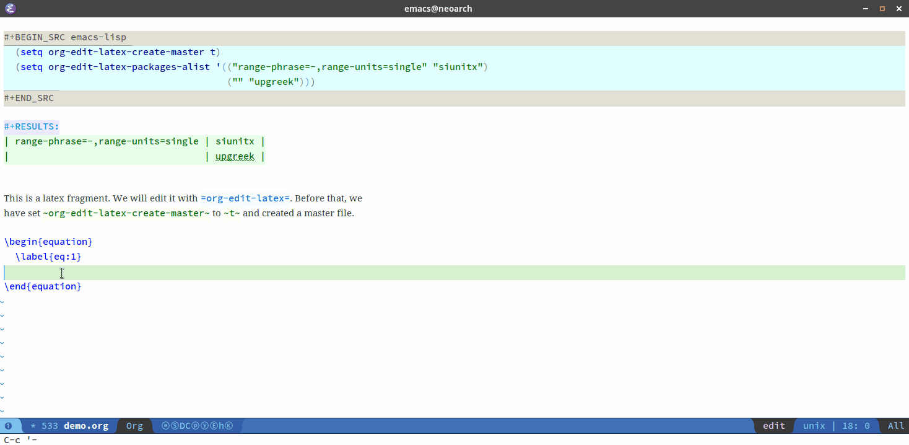

[](http://melpa.milkbox.net/#/org-edit-latex)

## Org Edit LaTeX

With this package, you can edit a latex fragment/environment in an edit
buffer, and you can even complete and preview LaTeX in the edit buffer.

The latest release of Org (version 9.1) provides a similar feature, i.e. edit
a latex environment in an edit buffer. But there are still some features
offered here are not in org yet. Some of them are:

- Complete based on your latex header.

  With org-edit-latex, you can complete your latex commands according to the
  #+latex_header: lines in your main org buffer (powered by AucTeX). This is not
  possible in vanilla org.

- Preview in the edit buffer.

  You don't have to quit your edit buffer to do the preview. You can just
  preview at point! With the fantastic AucTeX working behind, you can cache
  your preamble and preview really fast (faster than org-preview).

- Edit and preview latex fragments in edit buffer.

  Besides LaTeX environments, you can also edit/preview latex fragments in edit
  buffer. This may not count as a feature. but in case you need it, it's there.

This package has been tested on Org 8.0 and above. Feel free to use it on
Org mode shipped with emacs.


### Install

First, download `org-edit-latex` and add following to your init file:

```
(require 'org-edit-latex)
```

You should add `latex` to your `org-babel-load-languages`:

```
(org-babel-do-load-languages
 'org-babel-load-languages
 '((emacs-lisp . t)
   (latex . t)   ;; <== add latex to the list
   (python . t)
   (shell . t)
   (ruby . t)
   (perl . t)))
```

### Basic Usage
Turn on `org-edit-latex-mode` and use following commands to start/exit/abort a
edit buffer.

- `org-edit-special`: enter a dedicated LaTeX buffer.
- `org-edit-src-exit`: exit LaTeX buffer when you finished editing.
- `org-edit-src-abort`: quit editing without saving changes.

Note that all above commands are built-in Org commands and your current
keybindings will probably do the job.

### Inline Math
Inline latex is also supported, but I don't recommend using this package on
simple inline math, such as math symbols, SI units, etc. For that use case, you
may check cdlatex, which is more than enough to handle that. The setup of
cdlatex is pretty straightforward, see
<https://github.com/jkitchin/scimax/issues/117> to get a general idea.

### Entry Point
To get started, you may also want to check out
[yasnippet](https://github.com/joaotavora/yasnippet) to fast insert a latex
environment before you can use `org-edit-special` to enter the edit buffer.

For instance, try `M-x yas-new-snippet` and insert a snippet like this:
```
# -*- mode: snippet -*-
# name: eqn
# key: eqn
# --
\begin{equation}
  \label{eq:1}
  $0
\end{equation}
```
After you loaded the snippet, type `eqn` and press tab to insert the snippet.
Then you can call `org-edit-special` to enter the edit buffer.

### TeX Master
By default, `org-edit-latex` will generate a TeX-master file automatically. The
master file is used for:

- Completion in edit buffer via AucTeX
- Preview in the edit buffer

The LaTeX preamble used by the master file is the same as
[org-preview](http://orgmode.org/worg/org-tutorials/org-latex-preview.html)
settings. 

The master file locates in the same directory as the org file does. You can
update the master file via `org-edit-latex-update-master` after changing the
preview settings.

You can use `org-edit-latex-preview-at-point` to preview in a edit buffer. By
default, the keybinding of `preview-at-point` (AucTeX) is remapped to this
function.

#### Demo
**w/o master:**


**with master:**


### Change Log
- 0.8.0 Add support for TeX-master; provide preview function.
- 0.7.0 Fix a few bugs regarding latex fragment/environment with name/caption/attrib.
- 0.6.3 Fix inline math issue caused by a bug from org.
- 0.6.2 src blocks will be untouched.
- 0.6.1 Fix inline src block not recognized.
- 0.6.0 Editing of inline latex (including non math latex fragments) is supported.
...

### TODO
- [x] Mention cdlatex
- [x] Mention yasnippet
- [x] Add more demo gifs
- [x] Add support for inline math.
- [x] Turn this feature into a minor mode. (by purcell)
